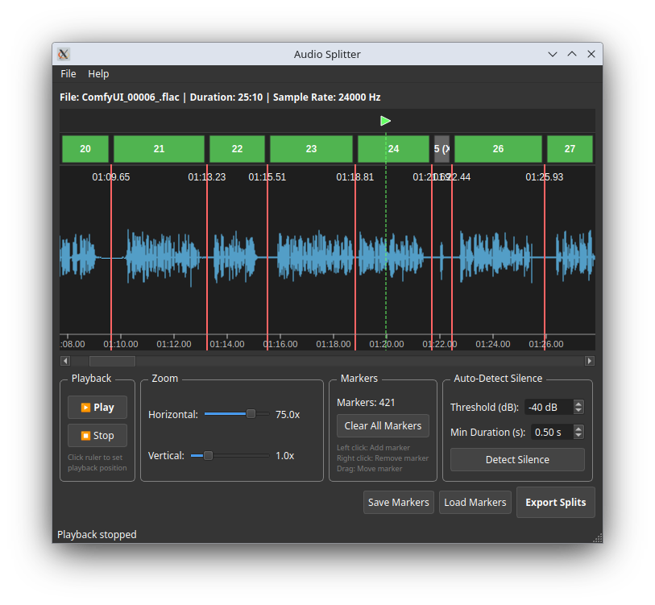

# Audio Splitter

A powerful desktop application for splitting large audio files with an intuitive waveform visualization interface.



## Features

### Core Functionality
- **Multi-Format Support**: Load audio files in MP3, WAV, FLAC, and OGG formats
- **Waveform Visualization**: Interactive waveform display with zoom and scroll capabilities
- **Interactive Markers**: Add, remove, and drag split markers directly on the waveform
- **Auto-Detect Silence**: Automatically find silent regions and place markers
- **Marker Persistence**: Save and load marker positions to/from JSON files
- **Flexible Export**: Export splits with customizable format, quality, and audio settings

### Advanced Features
- **Horizontal Zoom**: Zoom in up to 100x for precise marker placement
- **Vertical Zoom**: Scale waveform amplitude for better visibility
- **Horizontal Scrollbar**: Navigate through long audio files easily
- **Large File Support**: Efficiently handle audio files up to 2GB
- **Silence Trimming**: Automatically trim silence from beginning and end of splits
- **Custom Sample Rates**: Choose from 8kHz to 192kHz output sample rates
- **Mono/Stereo Output**: Convert between mono and stereo during export
- **Quality Settings**: Configure bitrate for compressed formats (MP3, OGG)

## Installation

### Prerequisites
- Python 3.8 or higher
- FFmpeg (required for MP3 support)

### Installing FFmpeg

**Ubuntu/Debian:**
```bash
sudo apt update
sudo apt install ffmpeg
```

**macOS (using Homebrew):**
```bash
brew install ffmpeg
```

**Windows:**
Download from [ffmpeg.org](https://ffmpeg.org/download.html) and add to PATH.

### Installing Audio Splitter

1. **Clone or download this repository:**
```bash
cd audio_splitter
```

2. **Create a virtual environment (recommended):**
```bash
python3 -m venv venv
source venv/bin/activate  # On Windows: venv\Scripts\activate
```

3. **Install dependencies:**
```bash
pip install -r requirements.txt
```

## Usage

### Running the Application

```bash
source venv/bin/activate 
python main.py
```

### Basic Workflow

1. **Load Audio File**
   - Click `File > Load Audio...` or press `Ctrl+O`
   - Select an audio file (MP3, WAV, FLAC, or OGG)
   - The waveform will be displayed

2. **Add Split Markers**
   - **Manual**: Left-click on the waveform to add a marker
   - **Auto-detect**: Configure silence detection settings and click "Detect Silence"
     - Threshold: Silence level in decibels (-80 to 0 dB)
     - Min Duration: Minimum silence length to detect (0.1 to 10 seconds)

3. **Adjust Markers**
   - **Move**: Click and drag a marker to reposition it
   - **Remove**: Right-click on a marker to delete it
   - **Clear All**: Click "Clear All Markers" to remove all markers

4. **Zoom and Navigate**
   - **Horizontal Zoom**: Use the slider to zoom in/out (1x to 100x)
   - **Vertical Zoom**: Adjust waveform amplitude (0.1x to 5x)
   - **Scroll**: Use the horizontal scrollbar when zoomed in

5. **Save/Load Markers**
   - **Save**: Click "Save Markers" to save marker positions to a JSON file
   - **Load**: Click "Load Markers" to load previously saved markers
   - The JSON file includes the audio filename for reference

6. **Export Splits**
   - Click "Export Splits" to open the export dialog
   - Configure settings:
     - **Output Format**: WAV, MP3, FLAC, or OGG
     - **Sample Rate**: 8000 to 192000 Hz
     - **Channels**: Stereo or Mono
     - **Quality**: Low/Medium/High bitrate (for MP3/OGG)
     - **Output Folder**: Where to save the split files
     - **Filename Prefix**: Prefix for output files (e.g., "split")
     - **Trim Silence**: Optionally trim silence from each split
   - Click "Export" to generate the split files

### Output Files

Split files are automatically numbered with leading zeros:
- `prefix_001.mp3`
- `prefix_002.mp3`
- `prefix_003.mp3`
- etc.

The number of digits adapts to the number of splits (e.g., 3 digits for 100-999 splits).

## Marker JSON Format

Saved marker files use the following JSON structure:

```json
{
  "audio_filename": "example.mp3",
  "markers": [
    15.5,
    32.8,
    48.2,
    65.0
  ]
}
```

- `audio_filename`: Name of the associated audio file
- `markers`: Array of marker positions in seconds

## Keyboard Shortcuts

- `Ctrl+O`: Open audio file
- `Ctrl+Q`: Quit application

## Tips & Best Practices

### For Precise Splitting
1. Use high horizontal zoom (50x-100x) for accurate marker placement
2. Place markers at zero-crossings to avoid clicks in the output
3. Use the vertical zoom to see small amplitude changes

### For Large Files
1. The application efficiently handles files up to 2GB
2. Initial loading may take a few seconds for very large files
3. Waveform rendering is optimized for smooth display

### For Speech/Podcast Splitting
1. Use auto-detect silence with:
   - Threshold: -40 dB to -50 dB
   - Min Duration: 0.5 to 1.0 seconds
2. Enable "Trim silence" in export settings

### For Music Splitting
1. Manually place markers at song boundaries
2. Use higher vertical zoom to see beat patterns
3. Export as FLAC or WAV for lossless quality

## Technical Details

### Audio Processing
- Uses `librosa` for audio loading and analysis
- Uses `soundfile` for WAV and FLAC export
- Uses `pydub` with FFmpeg for MP3 and OGG conversion

### Waveform Rendering
- Efficient downsampling for display (configurable samples per pixel)
- Min/max values calculated for each pixel column
- Real-time rendering with zoom and scroll

### Supported Formats

**Input:**
- MP3 (MPEG Audio Layer 3)
- WAV (Waveform Audio File Format)
- FLAC (Free Lossless Audio Codec)
- OGG (Ogg Vorbis)

**Output:**
- WAV: PCM 16-bit (lossless)
- FLAC: Lossless compression
- MP3: Lossy compression (128/192/320 kbps)
- OGG: Lossy compression (128/192/320 kbps)

## Troubleshooting

### "Error loading audio" message
- Ensure FFmpeg is installed and in your PATH
- Check that the audio file is not corrupted
- Try converting the file to WAV first

### Waveform not displaying
- Check that the audio file loaded successfully
- Verify the file contains audio data
- Try reloading the file

### Export fails
- Ensure the output folder exists and is writable
- Check that you have enough disk space
- Verify FFmpeg is installed for MP3/OGG export

### Application crashes on large files
- Ensure you have sufficient RAM (recommended 4GB+)
- Close other applications to free up memory
- Try reducing the horizontal zoom level

## System Requirements

- **OS**: Windows 10+, macOS 10.14+, or Linux
- **RAM**: 4GB minimum, 8GB+ recommended for large files
- **Disk Space**: Enough for input file + output splits
- **Python**: 3.8 or higher
- **Display**: 1024x768 minimum resolution

## Dependencies

- PyQt6 >= 6.6.0 - GUI framework
- numpy >= 1.24.0 - Numerical operations
- librosa >= 0.10.0 - Audio analysis
- soundfile >= 0.12.0 - Audio file I/O
- pydub >= 0.25.1 - Audio format conversion
- matplotlib >= 3.7.0 - Plotting utilities
- scipy >= 1.11.0 - Scientific computing

## License

This project is provided as-is for educational and personal use.

## Contributing

Contributions are welcome! Please feel free to submit issues or pull requests.

## Acknowledgments

- Built with PyQt6 for the GUI framework
- Audio processing powered by librosa and soundfile
- Format conversion using pydub with FFmpeg backend

## Version History

### Version 1.0 (Current)
- Initial release
- Multi-format audio loading
- Interactive waveform visualization
- Draggable split markers
- Auto-detect silence
- Marker save/load functionality
- Flexible export options

## Support

For issues, questions, or feature requests, please open an issue on the project repository.
